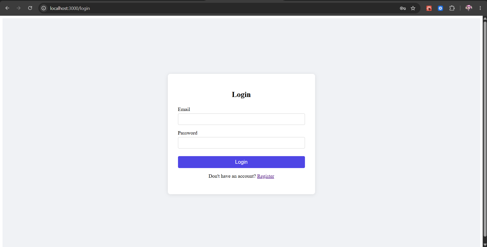
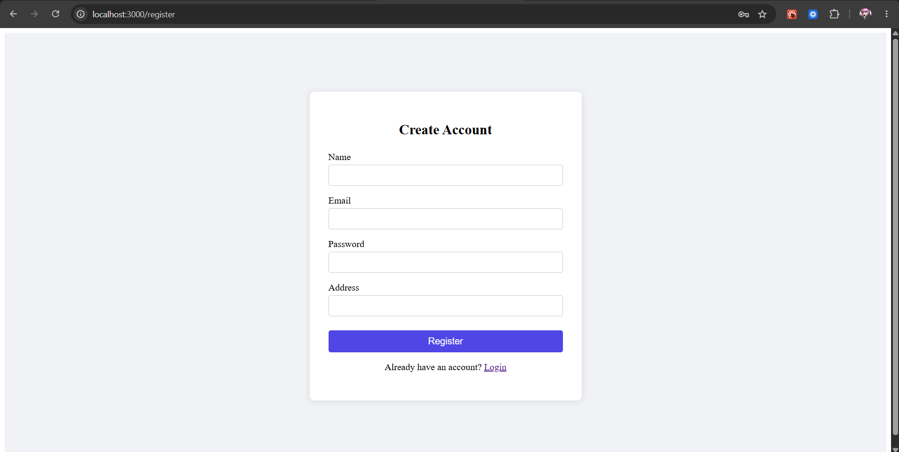
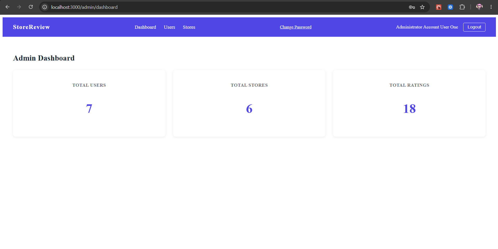
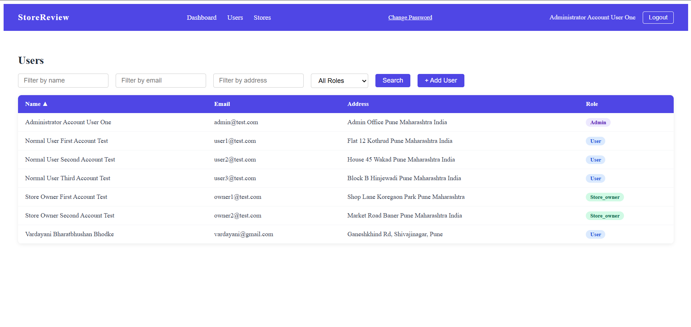
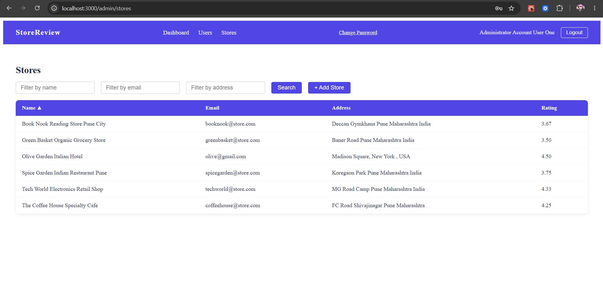
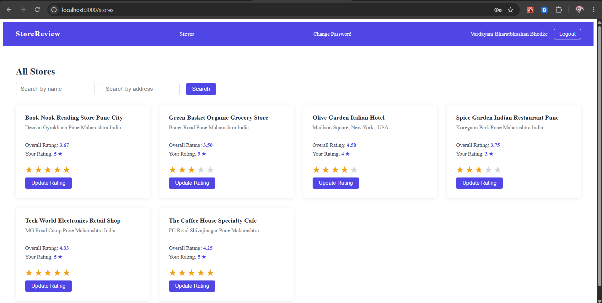
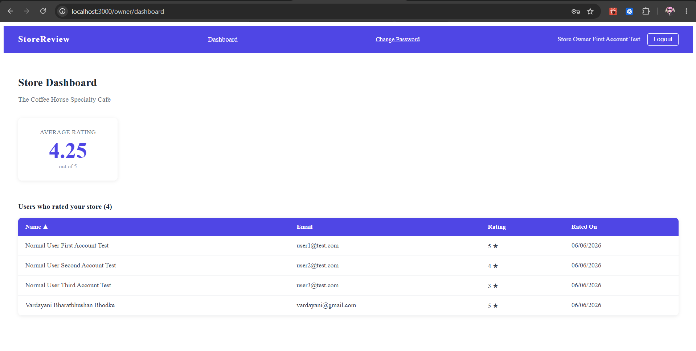
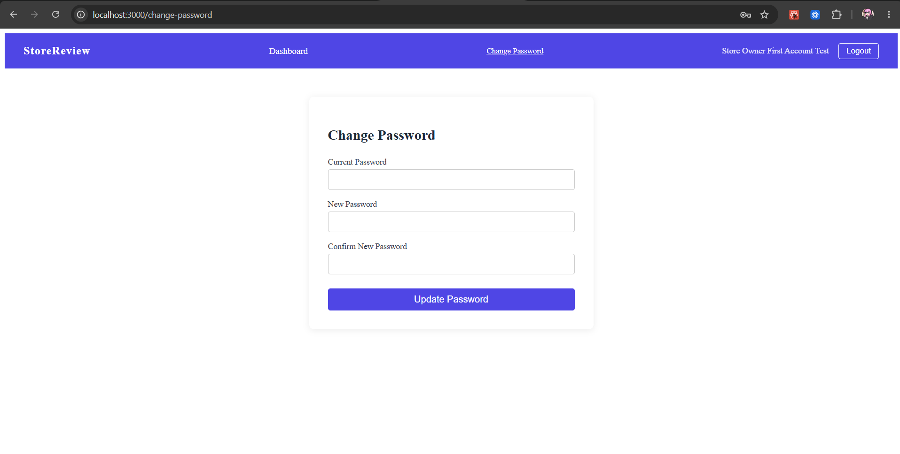

# Store Review Application

A full-stack web application where users can discover and rate stores registered on the platform. Built as part of a Full Stack Intern Coding Challenge.

---

## Table of Contents

- [Features](#features)
- [Tech Stack](#tech-stack)
- [Screenshots](#screenshots)
- [Database Schema](#database-schema)
- [Getting Started](#getting-started)
- [Environment Variables](#environment-variables)
- [Seed Data](#seed-data)
- [API Endpoints](#api-endpoints)
- [Form Validations](#form-validations)
- [Project Structure](#project-structure)

---

## Features

### System Administrator
- Dashboard with total counts of users, stores, and ratings
- Add new users (normal user, admin, or store owner) and new stores
- View and filter all users by name, email, address, and role
- View and filter all stores by name, email, and address
- Sortable tables (ascending/descending) on all key fields
- View individual user details; store owners also show their store's average rating

### Normal User
- Register and log in to the platform
- Browse all registered stores in a card-based layout
- Search stores by name or address
- Submit a star rating (1–5) for any store
- Update a previously submitted rating
- Each store card shows overall rating and the user's own submitted rating

### Store Owner
- Log in and view a personal dashboard
- See the average rating of their store
- View a sortable list of all users who rated their store

### All Roles
- Secure JWT-based authentication
- Change password from within the app
- Auto logout on token expiry

---

## Tech Stack

**Frontend**
- React 19
- React Router DOM
- Axios

**Backend**
- Node.js
- Express.js
- MySQL2
- bcryptjs
- JSON Web Tokens (JWT)

**Database**
- MySQL

---

## Screenshots

### Login Page


### Register Page


### Admin Dashboard


### Admin — Users Table


### Admin — Stores Table


### Store Listings (Normal User)


### Store Owner Dashboard


### Change Password


---

## Database Schema

```
users
  id           INT           PRIMARY KEY AUTO_INCREMENT
  name         VARCHAR(60)   NOT NULL
  email        VARCHAR(255)  NOT NULL UNIQUE
  password     VARCHAR(255)  NOT NULL
  address      VARCHAR(400)
  role         ENUM('admin', 'user', 'store_owner')
  created_at   TIMESTAMP     DEFAULT CURRENT_TIMESTAMP

stores
  id           INT           PRIMARY KEY AUTO_INCREMENT
  name         VARCHAR(60)   NOT NULL
  email        VARCHAR(255)  NOT NULL UNIQUE
  address      VARCHAR(400)
  owner_id     INT           FOREIGN KEY → users(id)
  created_at   TIMESTAMP     DEFAULT CURRENT_TIMESTAMP

ratings
  id           INT           PRIMARY KEY AUTO_INCREMENT
  user_id      INT           FOREIGN KEY → users(id)
  store_id     INT           FOREIGN KEY → stores(id)
  rating       TINYINT       CHECK (1–5)
  created_at   TIMESTAMP     DEFAULT CURRENT_TIMESTAMP
  UNIQUE (user_id, store_id)
```

---

## Getting Started

### Prerequisites

- Node.js v18+
- MySQL 8+
- npm

### 1. Clone the repository

```bash
git clone https://github.com/astha-gh/store-review-application.git
cd store-review-application
```

### 2. Set up the database

Open MySQL Workbench (or any MySQL client) and run:

```sql
CREATE DATABASE IF NOT EXISTS store_review_db;
USE store_review_db;

CREATE TABLE users (
  id INT AUTO_INCREMENT PRIMARY KEY,
  name VARCHAR(60) NOT NULL,
  email VARCHAR(255) NOT NULL UNIQUE,
  password VARCHAR(255) NOT NULL,
  address VARCHAR(400),
  role ENUM('admin', 'user', 'store_owner') NOT NULL DEFAULT 'user',
  created_at TIMESTAMP DEFAULT CURRENT_TIMESTAMP
);

CREATE TABLE stores (
  id INT AUTO_INCREMENT PRIMARY KEY,
  name VARCHAR(60) NOT NULL,
  email VARCHAR(255) NOT NULL UNIQUE,
  address VARCHAR(400),
  owner_id INT,
  created_at TIMESTAMP DEFAULT CURRENT_TIMESTAMP,
  FOREIGN KEY (owner_id) REFERENCES users(id) ON DELETE SET NULL
);

CREATE TABLE ratings (
  id INT AUTO_INCREMENT PRIMARY KEY,
  user_id INT NOT NULL,
  store_id INT NOT NULL,
  rating TINYINT NOT NULL CHECK (rating BETWEEN 1 AND 5),
  created_at TIMESTAMP DEFAULT CURRENT_TIMESTAMP,
  UNIQUE KEY unique_user_store (user_id, store_id),
  FOREIGN KEY (user_id) REFERENCES users(id) ON DELETE CASCADE,
  FOREIGN KEY (store_id) REFERENCES stores(id) ON DELETE CASCADE
);
```

### 3. Configure the backend

```bash
cd backend
npm install
```

Create a `.env` file in the `/backend` folder (see [Environment Variables](#environment-variables) below).

### 4. Seed demo data (optional but recommended)

```bash
npm run seed
```

This populates the database with demo users, stores, and ratings so you can explore all features immediately.

### 5. Start the backend

```bash
npm run dev
```

Backend runs on `http://localhost:5000`

### 6. Start the frontend

```bash
cd ../frontend
npm install
npm start
```

Frontend runs on `http://localhost:3000`

---

## Environment Variables

Create a `.env` file inside the `/backend` folder with the following:

```
DB_HOST=localhost
DB_USER=your_mysql_username
DB_PASSWORD=your_mysql_password
DB_NAME=store_review_db
PORT=5000
JWT_SECRET=your_secret_key_here
```

---

## Seed Data

Running `npm run seed` from the `/backend` folder clears and repopulates the database with the following demo accounts:

| Role        | Email              | Password   |
|-------------|--------------------|------------|
| Admin       | admin@test.com     | Admin@123  |
| Store Owner | owner1@test.com    | Owner@123  |
| Store Owner | owner2@test.com    | Owner@123  |
| Normal User | user1@test.com     | User@1234  |
| Normal User | user2@test.com     | User@1234  |
| Normal User | user3@test.com     | User@1234  |

---

## API Endpoints

### Auth — `/api/auth`

| Method | Endpoint           | Access       | Description          |
|--------|--------------------|--------------|----------------------|
| POST   | /register          | Public       | Register normal user |
| POST   | /login             | Public       | Login any user       |
| PUT    | /change-password   | Logged in    | Change password      |

### Admin — `/api/admin`

| Method | Endpoint      | Access | Description              |
|--------|---------------|--------|--------------------------|
| GET    | /dashboard    | Admin  | Total users/stores/ratings |
| GET    | /users        | Admin  | List users (filterable)  |
| GET    | /users/:id    | Admin  | Single user details      |
| POST   | /users        | Admin  | Add new user             |
| GET    | /stores       | Admin  | List stores (filterable) |
| POST   | /stores       | Admin  | Add new store            |

### Stores — `/api/stores`

| Method | Endpoint       | Access      | Description                        |
|--------|----------------|-------------|------------------------------------|
| GET    | /              | Normal User | List all stores with ratings       |
| POST   | /:id/rate      | Normal User | Submit or update a rating          |

### Store Owner — `/api/owner`

| Method | Endpoint    | Access      | Description                        |
|--------|-------------|-------------|------------------------------------|
| GET    | /dashboard  | Store Owner | Store stats and list of raters     |

---

## Form Validations

| Field    | Rules                                                              |
|----------|--------------------------------------------------------------------|
| Name     | Min 20 characters, max 60 characters                               |
| Email    | Standard email format                                              |
| Password | 8–16 characters, at least one uppercase letter, one special character |
| Address  | Max 400 characters                                                 |

Validations are enforced on both the frontend (immediate feedback) and the backend (server-side checks).

---

## Project Structure

```
store-review-application/
├── backend/
│   ├── src/
│   │   ├── config/
│   │   │   └── db.js
│   │   ├── controllers/
│   │   │   ├── authController.js
│   │   │   ├── adminController.js
│   │   │   ├── storeController.js
│   │   │   └── ownerController.js
│   │   ├── middleware/
│   │   │   └── authMiddleware.js
│   │   ├── routes/
│   │   │   ├── authRoutes.js
│   │   │   ├── adminRoutes.js
│   │   │   ├── storeRoutes.js
│   │   │   └── ownerRoutes.js
│   │   └── server.js
│   ├── seed.js
│   ├── .env
│   └── package.json
├── frontend/
│   ├── src/
│   │   ├── api/
│   │   │   └── axios.js
│   │   ├── components/
│   │   │   ├── Navbar.jsx
│   │   │   └── PrivateRoute.jsx
│   │   ├── context/
│   │   │   └── AuthContext.jsx
│   │   ├── pages/
│   │   │   ├── admin/
│   │   │   │   ├── AdminDashboard.jsx
│   │   │   │   ├── AdminUsers.jsx
│   │   │   │   └── AdminStores.jsx
│   │   │   ├── owner/
│   │   │   │   └── OwnerDashboard.jsx
│   │   │   ├── Login.jsx
│   │   │   ├── Register.jsx
│   │   │   ├── Stores.jsx
│   │   │   └── ChangePassword.jsx
│   │   ├── styles/
│   │   │   ├── Auth.css
│   │   │   ├── Navbar.css
│   │   │   ├── Dashboard.css
│   │   │   ├── Table.css
│   │   │   ├── Stores.css
│   │   │   ├── OwnerDashboard.css
│   │   │   └── ChangePassword.css
│   │   ├── App.js
│   │   └── index.js
│   └── package.json
└── README.md
```
